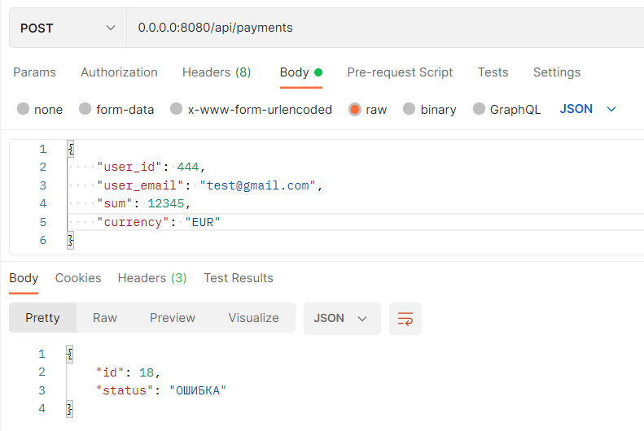
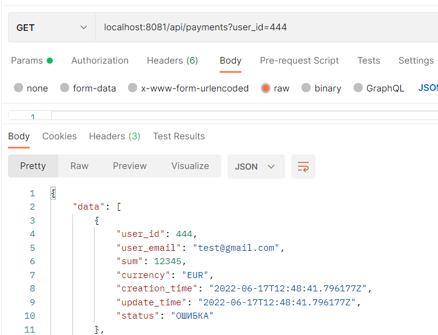

# payment-emulator
Payment emulator API

### Launch

```
docker build -t emulator .
docker run -p 8000:8080 -t emulator
```
You can replace ```8000``` port with any unused on your PC

### Endpoints
endpoint | method | body | response
--- | --- | --- | ---
/payments|POST|{user_id, user_email, sum, currency}| payment id, payment status 
/payments/status/:id|POST| |updated payment status
/payments/status/:id |GET| |current payment status
/payments?user_id=*id*|POST| |list of users payments
/payments?user_email=*email*|POST| |list of users payments
/payments/:id|PUT| |status of cancellation

#### Examples


